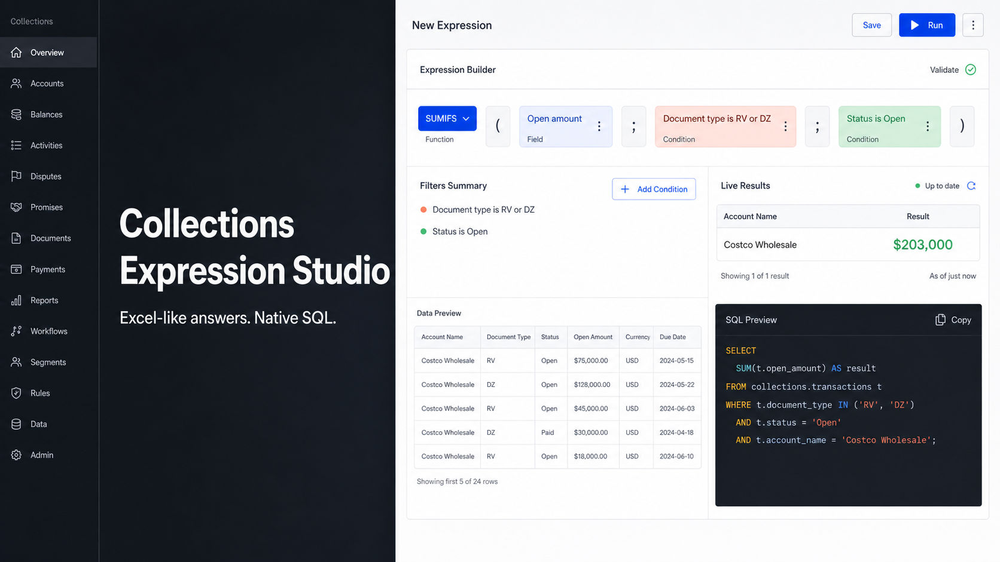

# Collections Expression Studio

A working product concept for creating Excel-like calculated fields directly
inside a collections application. Administrators can compose business logic
visually, test it against customer and invoice data, inspect the generated SQL,
and publish the result without writing code.

[Open the live prototype](https://collections-expression-builder-poc.galactic-sipu.chatgpt.site/)
&nbsp;&middot;&nbsp;
[Read the product story](https://collections-expression-builder-poc.galactic-sipu.chatgpt.site/story)



## The Product Idea

Many collections requirements are mathematically simple but operationally
expensive. A request such as "sum open amounts for selected document types at
customer level" can require exporting data to another analytical platform or
changing a Java agent.

Expression Studio keeps SQL-translatable calculations in the product:

1. Choose the output grain: customer or invoice.
2. Select a familiar spreadsheet function.
3. Combine approved fields and conditions visually.
4. Simulate the result on representative data.
5. Review the generated formula, SQL, and parameters.
6. Save or publish the calculated field.

## What The Prototype Demonstrates

- Grain-aware calculation building for customer and invoice fields
- Conditional aggregation with `SUMIFS`, `COUNTIFS`, and `AVERAGEIFS`
- Same-level math with `SUM`, `AVERAGE`, `DIFFERENCE`, `PRODUCT`, `MIN`, and
  `MAX`
- Type-aware text, number, amount, and date operators
- Grouped boolean logic using `(A AND B) OR (C AND D)`
- Automatic output-type inference
- Excel-equivalent formula and parameterized PostgreSQL previews
- Customer and invoice data grids with calculated-field results
- Focused simulation before publishing
- CSV upload journeys with 10 numeric, 10 text, and 10 date reference fields at
  each data level
- A companion product-story page covering the problem, principles,
  architecture, and roadmap

## Representative Expression

```text
For each Customer
use SUMIFS
to sum Invoice.OpenAmount
where Invoice.DocumentType is any of RV, DZ
and Invoice.Status is Open
```

The expression compiles into a governed aggregate query at customer grain. The
UI only exposes invoice measures because invoices are the child records being
aggregated.

## Technology

- React 19 and TypeScript
- Next.js-compatible App Router
- Vinext and Vite
- Cloudflare Workers-compatible output
- Lucide icons
- Node test runner and ESLint

The expression model, evaluator, formula translation, SQL compiler, sample
customers, sample invoices, and reference-field schema live in
`app/expression-data.ts`.

## Run Locally

Node.js `22.13.0` or newer is required.

```bash
npm install
npm run dev
```

Then open the local URL printed by the development server.

```bash
npm run lint
npm test
npm run build
```

## Project Structure

```text
app/
  expression-data.ts   Typed expression model, evaluator, and SQL compiler
  page.tsx              Expression Studio and data-management prototype
  story/                Product story and motion
public/                 Product imagery and social preview
tests/                  Rendered-application smoke tests
worker/                 Cloudflare-compatible worker entry point
```

## Status

This repository is a product-management proof of concept, not a production
expression engine. A production implementation would add server-side
persistence, permissions, expression versioning, dialect-aware SQL validation,
query-cost controls, audit history, and a sandboxed execution service.
